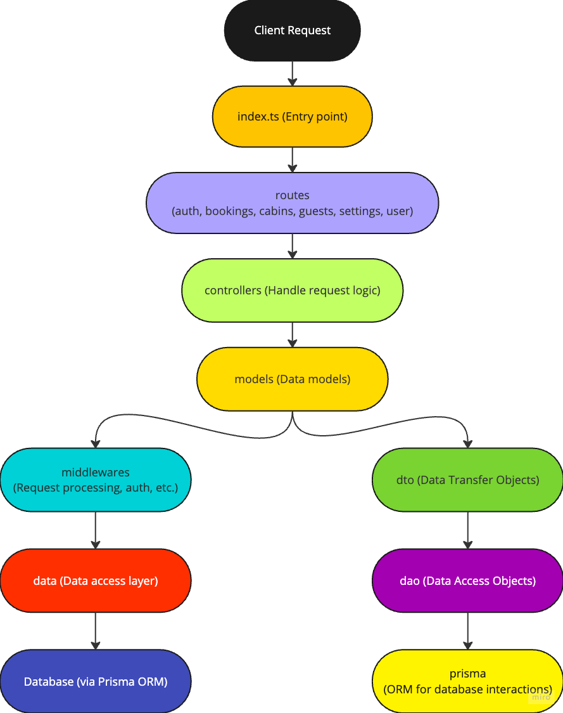
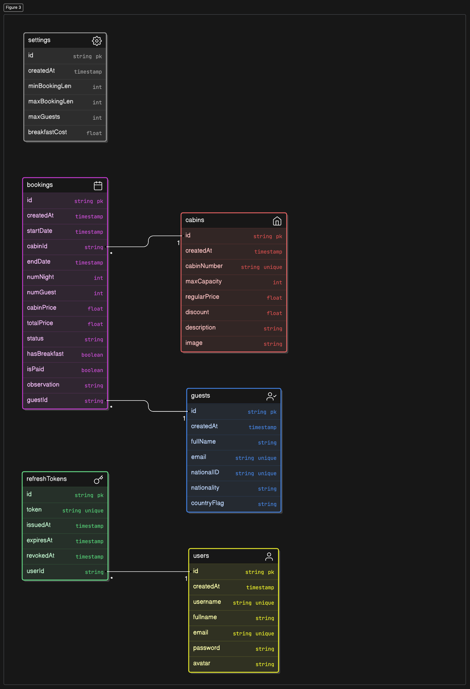

# theWildOasis

A full-stack application for managing hotel cabins.

## Technologies Used

### Client-Side

- React (with Vite)
- React Router
- React Query
- Axios
- React Hook Form
- React Hot Toast
- Tailwind CSS

### Server-Side

- Node.js
- Express
- Prisma (ORM)
- JSON Web Tokens (JWT)
- bcrypt.js

## Server Architecture

## Database Schema

## API Endpoints

- `/api/v1/cabins`: Manage cabin data
- `/api/v1/guests`: Manage guest information
- `/api/v1/bookings`: Handle booking operations
- `/api/v1/auth`: User authentication
- `/api/v1/settings`: Manage application settings

## Authentication

The application uses JSON Web Tokens (JWT) for authentication. Protected routes
on both client and server sides ensure that only authenticated users can access
certain features.

## Deployment

- [Client](https://the-wild-oasis-gilt-zeta.vercel.app/): Deployed on Vercel
- [Server](https://thewildoasis.onrender.com): Deployed on Render
- Database: Deployed on Render
